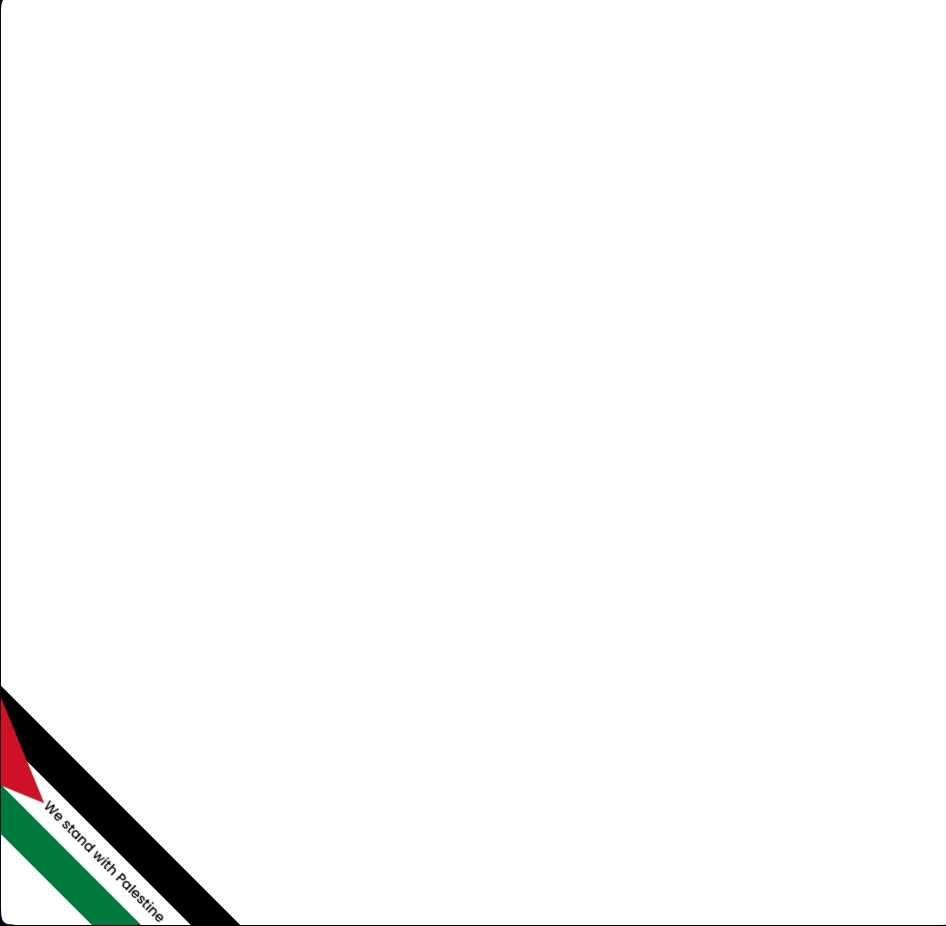

## We stand with Palestine

Palestine flag banner to show support from your website.

### Installation
```
<script src="https://cdn.jsdelivr.net/gh/devkayes/we-stand-with-palestine@main/ribbon-banner.js" async></script>
```

### Parameters

You can customize the banner with additional parameters by setting script attributes:

- ```title```

    (string) The tooltip text to display on banner hover

    Default: ```'We stand with Palestine'```

```
<script src="https://cdn.jsdelivr.net/gh/devkayes/we-stand-with-palestine@main/ribbon-banner.js" title="We support Palestine" async></script>
```

### Preview
